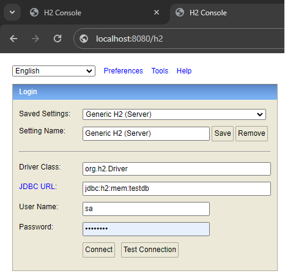

# SAT User Management System

## Descrição do Projeto
O SAT User Management System é um aplicativo CRUD de backend desenvolvido em Java, utilizando Spring Boot, para gerenciar usuários. Ele permite criar, ler, atualizar e deletar informações de usuários, incluindo nome, e-mail, CPF e telefone.

## Funcionalidades
- **Criação de usuário:** Adiciona um novo usuário ao sistema.
- **Leitura de usuário:** Recupera informações de um usuário específico ou de todos os usuários.
- **Atualização de usuário:** Atualiza os dados de um usuário existente.
- **Deleção de usuário:** Remove um usuário do sistema.

## Utilizando a aplicação
Para instalar e executar este projeto, siga os seguintes passos:

Execute o projeto com Maven:
   ```
   sudo apt install maven
   mvn clean install
   sudo apt  install gradle
   sudo apt install openjdk-17-jdk
   mvn clean install
   mvn spring-boot:run
   ```

## Executando os Testes
Os testes podem ser executados com o seguinte comando:
```
mvn test
```
Estes testes incluem testes de integração e testes de unidade para garantir a funcionalidade correta do sistema.

## Banco de Dados H2
Este projeto utiliza o banco de dados H2, um banco de dados em memória. Para acessar a console H2:
1. Certifique-se de que o aplicativo está em execução.
2. Navegue para `http://localhost:8080/h2`.
3. Faça login com as credenciais configuradas no `application.properties`.



